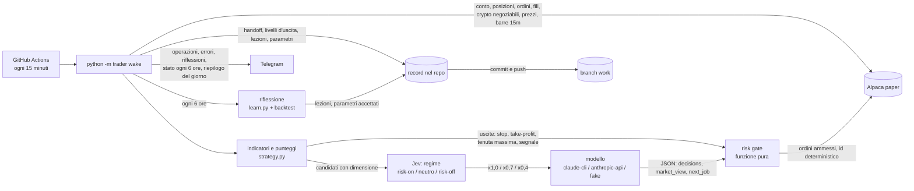

# trader

Un agente che fa trading di crypto su un conto **Alpaca paper** (soldi finti), da solo.
GitHub Actions lo sveglia ogni 15 minuti. A ogni risveglio non ricorda niente: ricostruisce
la situazione da Alpaca e dai record nel repo, calcola indicatori e punteggi per 31 crypto,
fa rispettare stop e take-profit, chiede una proposta a un modello solo quando c'è qualcosa
da comprare, la fa passare da un controllo del rischio scritto in codice, invia gli ordini
ammessi e salva tutto con un commit. Ogni 6 ore rilegge le proprie operazioni, scrive delle
lezioni e può spostare di poco i propri parametri, se un backtest dice che non peggiorano.
Per non restare fermo quando la regola d'ingresso non trova niente, può aprire piccole posizioni
di **esplorazione** (al massimo l'1,5% del patrimonio ciascuna, il 15% in tutto), che la riflessione
giudica a parte.

Il modello propone e basta. Le regole che contano (cosa comprare, quanto, quando uscire,
quando fermarsi) sono codice deterministico, con un test per ogni rifiuto.

La strategia, i numeri del backtest e i loro limiti sono in [STRATEGY.md](STRATEGY.md).

## Architettura



| Modulo | Cosa fa |
|---|---|
| `trader/slot.py` | Lo slot (il blocco di 15 minuti), gli slot saltati, il blocco di 6 ore |
| `trader/broker.py` | Client REST di Alpaca con `urllib`; letture con retry, invio ordini senza retry |
| `trader/indicators.py` | EMA, RSI, MACD, Bollinger, ATR, ADX, volume z-score, classifica: funzioni pure |
| `trader/strategy.py` | Punteggio, regola d'ingresso, lista corta, dimensione, stop e take-profit, parametri e loro limiti |
| `trader/context.py` | Da Alpaca a: universo, mercato, posizioni con i livelli d'uscita, prompt del modello |
| `trader/jev.py` | Il regime di mercato di Jev (con Groq come riserva): solo un moltiplicatore della dimensione |
| `trader/model.py` | Schema della proposta, validazione rigida, adattatori dei modelli |
| `trader/risk.py` | Il gate: funzione pura, un motivo per ogni rifiuto |
| `trader/orders.py` | Invio idempotente per `client_order_id` |
| `trader/learn.py` | Operazioni chiuse, attribuzione per segnale, riflessione, regola di accettazione |
| `trader/backtest.py` | Backtest su barre da 15 minuti con commissioni e spread; valuta le modifiche della riflessione |
| `trader/records.py` | Scrittura dei record, con rimozione dei segreti |
| `trader/publish.py` | Commit e push dei record, anche quando un altro risveglio ha già fatto push |
| `trader/notify.py` | Messaggi Telegram in HTML |
| `trader/trace.py` | La traccia passo per passo sul terminale e nel log di Actions, righe entro 100 colonne |
| `trader/wake.py` | Un risveglio dall'inizio alla fine |
| `trader/fake_alpaca.py` | Un conto Alpaca finto in memoria, per test, simulazione e prove locali |
| `ui/` | Un cruscotto locale costruito dai record ([ui/README.md](ui/README.md)) |

Solo libreria standard di Python 3.12 a runtime. `pytest` e `ruff` servono solo in sviluppo; la CI
esegue `ruff check .` su tutto il repo, `ui/` compreso, con la versione fissata in `uv.lock`.

## Un risveglio, passo per passo

1. **Slot.** Il cron chiede un risveglio ogni 15 minuti, ma GitHub avvia i run programmati in
   ritardo e a volte non li avvia affatto (vedi [Chi lo sveglia](#chi-lo-sveglia)). Lo slot è il
   blocco di 15 minuti in cui il run parte (per esempio `20260926T0815Z`). Uno slot saltato si
   registra e non si recupera.
2. **Ordini fermi.** Un nostro ordine (`trd-`) ancora aperto dopo 20 minuti viene annullato,
   scritto nel journal e segnalato su Telegram. Un ordine a mercato di solito si esegue in pochi
   secondi; sul paper, il 27 settembre 2026, due acquisti (POL e RENDER) sono rimasti aperti per
   ore, e un ordine aperto blocca ogni altro ordine sullo stesso simbolo, anche la vendita di uno
   stop. Se era un'uscita, lo stesso risveglio la rimanda con l'id del nuovo slot.
3. **Contesto.** Da Alpaca: conto, posizioni, ordini aperti, ordini e fill recenti, le crypto
   negoziabili, i prezzi e 10 giorni di barre da 15 minuti per ogni crypto. Dal repo: l'ultimo
   handoff, i livelli d'uscita delle posizioni, i parametri, le ultime lezioni.
4. **Riconciliazione.** Ordini `trd-` che Alpaca conosce e le evidence no vengono da un run
   interrotto: si registrano e si segnalano. Se lo slot ha già ordini, o è già completato, il run
   resta in sola lettura.
5. **Universo e mercato.** Le 31 crypto ammesse (`config/limits.toml`, dentro la lista nel
   codice) incrociate con quelle che Alpaca dà come negoziabili adesso. Per ciascuna, sulle
   barre chiuse a 15 minuti, 1 ora e 4 ore: tendenza (EMA 9/21/50), RSI, MACD, Bollinger, ATR,
   volume, forza della tendenza (ADX) e la classifica del rendimento a 24 ore. Ne esce un
   punteggio tra -1 e +1.
6. **Uscite, prima di tutto.** Per ogni posizione il codice aggiorna lo stop mobile (sale e non
   scende mai) e vende a stop, take-profit, tenuta massima o punteggio troppo basso, qualunque
   cosa dica il modello. Stop e take-profit stanno in `state/positions.json`; se il file manca
   si ricostruiscono dai fill di Alpaca.
7. **Candidati.** Una crypto è candidata se passa la regola d'ingresso (punteggio, movimento
   atteso molte volte più grande di commissioni e spread, filtro di mercato), non è già in
   portafoglio, non è in pausa dopo un'uscita e non ha ordini aperti. Per ognuna il codice
   calcola l'importo massimo con gli stessi tetti del gate.
8. **Esplorazione.** Le crypto della lista corta che non passano la regola d'ingresso ma sono in
   tendenza positiva sul 4h, con un take-profit che copre almeno 3 volte i costi di un giro
   (`strategy.explore_ok`), diventano candidati di esplorazione: al massimo l'1,5% del patrimonio
   ciascuno e il 15% per tutte le posizioni di esplorazione insieme, tetti nel codice. Il filtro di
   mercato e la soglia del punteggio non valgono qui; tutti gli altri limiti e tutte le uscite sì.
   Servono a dare alla riflessione operazioni da cui imparare quando la regola stretta non ne fa.
9. **Regime.** Solo se ci sono candidati, Jev classifica il mercato: risk-on (x1,0), neutro
   (x0,7) o risk-off (x0,4). Scala la dimensione e basta: non decide se comprare. Jev giù,
   chiave mancante, risposta incerta: neutro. Ogni chiamata finisce nel journal.
10. **Proposta.** Solo se ci sono candidati (anche di esplorazione), il modello riceve `prompts/decide.md` con candidati,
   posizioni, ultime operazioni e lezioni, e risponde in JSON:
   `{"decisions":[{"symbol","action","notional_usd","bull_case","bear_case","reason"}], "market_view", "next_job"}`.
   Per ogni decisione scrive prima una frase a favore e una contro. JSON rotto, chiavi in più,
   rifiuto, timeout: nessun acquisto, e le uscite del punto 6 partono lo stesso.
11. **Gate.** `risk.gate()` decide ordine per ordine, con un motivo scritto per ogni rifiuto.
12. **Ordini.** Solo quelli ammessi, con `client_order_id` deterministico
    `trd-<slot>-<simbolo>-<lato>`. Per ogni acquisto il codice registra stop e take-profit, e
    l'etichetta `explore` se è un acquisto di esplorazione.
13. **Record e Telegram.** Handoff, journal, evidence e livelli d'uscita; il workflow fa commit
    e push su `work` con `python -m trader save-records`. Se un altro risveglio ha fatto push
    prima, i record di questo vengono riscritti sopra i suoi (righe aggiunte in coda, voci di
    `progress.md` in ordine, handoff del risveglio più recente) invece di un rebase, che su questi
    file andava in conflitto ogni volta. Se il push fallisce lo stesso, arriva un avviso su
    Telegram. Il messaggio del risveglio parte solo se c'è qualcosa da dire (vedi sotto).
14. **Ogni 6 ore** (blocchi 00, 06, 12, 18 UTC): la riflessione e un messaggio di stato.
    **Una volta al giorno**: il riepilogo.

I record e il messaggio stanno in un `finally`: qualunque cosa succeda prima, il handoff viene
scritto. In `--dry-run` nessun ordine parte, i record vanno in una copia temporanea e il
messaggio Telegram parte comunque, con in testa **PROVA**.

## Il ciclo di apprendimento

Ogni 6 ore, al primo risveglio del blocco:

1. Il codice ricostruisce le operazioni chiuse dai fill di Alpaca (solo gli ordini `trd-`),
   al netto delle commissioni, e per ogni segnale calcola come sono andate le operazioni quando
   spingeva per l'entrata e quando no. Le operazioni della regola e quelle di esplorazione sono
   riassunte a parte (`summary_by_kind`): se le esplorazioni vanno bene più volte, è un indizio
   che la soglia d'ingresso è troppo alta.
2. Il modello legge questi numeri, il journal e le lezioni precedenti (`prompts/reflect.md`) e
   risponde con al massimo 5 lezioni e 3 proposte di modifica dei parametri.
3. Una modifica passa solo se:
   - il parametro è tra quelli che si possono imparare (`LEARNABLE` in `trader/strategy.py`:
     pesi, soglie d'ingresso e d'uscita, multipli di ATR, lunghezza della lista corta);
   - il nuovo valore sta nei limiti e si sposta al massimo di un piccolo passo
     (`PARAM_BOUNDS`, una tabella sola per tutto il repo);
   - un backtest sugli ultimi 14 giorni di barre fresche, con le commissioni e lo spread di ogni
     crypto, non va peggio con il nuovo valore che con quello attuale: rendimento netto non più
     basso e drawdown massimo non più profondo di 1 punto (`backtest.compare`).
4. Le lezioni vanno in cima a `lessons/lessons.md`, le modifiche accettate in
   `config/params.json`; il commit dice quali e perché. Le respinte finiscono nel journal con il
   motivo. Risposta non valida: nessuna lezione, nessuna modifica.

I limiti di rischio, il filtro di mercato e il margine sulle commissioni (`min_edge_mult`) non
si imparano: una riflessione che prova a toccarli viene respinta.

## Limiti di rischio

I tetti sono nel codice (`trader/config.py`); `config/limits.toml` può solo abbassarli.

| Limite | Tetto nel codice |
|---|---|
| Investito in crypto | 60% del patrimonio |
| Per crypto | 8% del patrimonio |
| Per memecoin (DOGE, SHIB, PEPE, BONK, WIF, TRUMP, FLOKI) | 3% del patrimonio |
| Posizioni aperte (gli acquisti non ancora eseguiti contano) | 25 |
| Ordini per risveglio, uscite comprese | 5 (il file ne chiede 3) |
| Perdita dalla chiusura precedente | oltre il 5%: niente acquisti, vendite ammesse |
| Ordine minimo | 10 $ (il file non può abbassarlo); la vendita di tutta la posizione chiede solo il minimo di Alpaca, circa 1 $ |
| Esplorazione | 1,5% del patrimonio per acquisto, 15% in tutto; il file può solo abbassarli (0 la spegne) |
| Acquisti | solo candidati della strategia, fino al loro importo massimo |
| Vendite allo scoperto | mai: si vende al massimo quello che c'è |
| Liquidità | ogni acquisto consuma la liquidità per i successivi dello stesso risveglio |
| `TRADING_ENABLED` non `true` | niente acquisti; stop, take-profit e le altre uscite vendono |
| `LIQUIDATE=true` | vende tutto, annulla gli ordini aperti, manda il risultato |
| File `KILL` | nessun ordine, nemmeno le uscite né gli annullamenti |
| Ordini aperti da 20 minuti | annullati all'inizio del risveglio successivo (solo i nostri, `trd-`) |

## Telegram

| Quando | Cosa |
|---|---|
| Un'operazione | Entrata con importo, stop e take-profit; uscita con il motivo (stop, take-profit, tenuta massima, segnale) |
| Un guasto | Alpaca giù, modello inutilizzabile, ordine non confermato, uscita respinta, ordine fermo annullato, record persi, push dei record fallito, bug nella chiamata a Jev |
| Un messaggio perso | Se Telegram non ha preso il messaggio di un risveglio, il successivo lo dice, con il riassunto |
| Una liquidazione | Le vendite, poi una volta sola il risultato realizzato: patrimonio, partenza, guadagno o perdita, operazioni chiuse |
| Una riflessione | Lezioni, modifiche accettate e respinte con il motivo |
| Ogni 6 ore | Stato: patrimonio, oggi e dall'inizio, filtro di mercato, posizioni con lo stop |
| Una volta al giorno | Riepilogo: patrimonio, guadagno del giorno e dall'inizio, operazioni, vinte, migliore e peggiore |
| Un risveglio tranquillo | Niente |

Stato e riepilogo si segnano come inviati solo quando Telegram li ha accettati: se l'invio
fallisce, ci riprova il risveglio successivo. Il testo libero del modello (`market_view`,
`next_job`, i motivi) viene ripulito da residui come `</next_job>` prima di finire nei record,
nei messaggi e nel prompt del risveglio dopo.

## Proprietà di sicurezza e come sono provate

Ogni proprietà ha un test che verifica il **rifiuto**, non solo il caso buono.
`uv run pytest` le esegue tutte, senza rete (una fixture blocca ogni chiamata HTTP).
`uv run python scripts/simulate.py` mostra gli stessi casi uno per uno sul terminale.

| Proprietà | Test |
|---|---|
| Solo paper: qualsiasi URL diverso da `https://paper-api.alpaca.markets` blocca l'avvio | `test_paper_guard_refuses_anything_but_paper`, `test_live_url_in_env_stops_the_wake` |
| Segreti mancanti: errore chiaro con i nomi delle variabili | `test_missing_secrets_fail_loudly` |
| Solo crypto ammesse e negoziabili | `test_rejects_symbol_outside_allowlist`, `test_symbols_alpaca_does_not_list_as_tradable_are_left_out` |
| Solo i candidati della strategia, al massimo per il loro importo | `test_rejects_a_buy_the_strategy_did_not_select`, `test_rejects_a_buy_over_the_strategy_size`, `test_a_buy_the_strategy_did_not_select_is_rejected` |
| Esplorazione: solo candidati di esplorazione, 1,5% per acquisto, 15% in tutto contando quelle aperte (una sola funzione, `risk.explore_exposure`), solo posizioni nuove, tutti gli altri limiti | `test_the_hard_exploration_caps_reject_a_buy_over_them`, `test_explore_exposure_counts_held_and_pending_exploration_only`, `test_rejects_an_exploration_buy_over_its_candidate_size`, `test_rejects_an_exploration_buy_over_one_percent_of_equity_whatever_the_size_says`, `test_rejects_exploration_beyond_five_percent_of_equity_counting_what_is_held`, `test_rejects_an_exploration_buy_on_a_coin_already_held`, `test_exploration_turned_off_in_the_config_rejects_every_exploration_buy`, `test_config_cannot_raise_the_exploration_caps`, `test_exploration_buys_obey_every_other_limit_too`, `test_explore_ok_rejects_what_it_must`, `test_held_exploration_counts_against_the_total_so_a_full_budget_asks_nobody`, `test_the_exploration_label_survives_lost_exit_levels` |
| Gli acquisti ancora aperti (non eseguiti) contano nell'investito, nel totale di esplorazione e nel numero di posizioni | `test_an_unfilled_buy_counts_toward_the_invested_cap`, `test_an_unfilled_exploration_buy_counts_toward_the_exploration_total`, `test_an_unfilled_buy_on_a_new_coin_counts_as_a_position`, `test_an_unfilled_exploration_buy_still_uses_the_budget` |
| Un'uscita non è bloccata dall'ordine minimo di 10 $, ma sì da quello di Alpaca | `test_a_whole_position_under_the_order_minimum_can_still_be_sold`, `test_a_partial_sell_under_the_order_minimum_is_still_rejected`, `test_a_whole_position_under_alpacas_minimum_is_rejected`, `test_a_position_worth_less_than_the_order_minimum_is_still_exited` |
| Tetti in % del patrimonio: per crypto, per memecoin, investito, numero di posizioni | `test_rejects_position_over_max_per_coin_of_equity`, `test_memecoin_cap_is_lower_than_the_coin_cap`, `test_rejects_invested_over_max_pct_of_equity`, `test_rejects_a_new_position_beyond_the_maximum_count`, `test_memecoin_is_sized_to_its_cap_and_a_bigger_buy_is_rejected` |
| Ordini per risveglio, ordine minimo | `test_rejects_more_orders_than_the_per_wake_maximum`, `test_rejects_order_under_min_size` |
| Perdita giornaliera oltre il limite: niente acquisti, vendite ammesse | `test_daily_loss_blocks_buys_but_allows_sells`, `test_daily_loss_blocks_buys_end_to_end` |
| File `KILL`: nessun ordine, uscite e annullamenti compresi | `test_kill_switch_rejects_every_order_even_sells`, `test_kill_file_stops_every_order`, `test_kill_switch_blocks_the_code_exits_too_and_says_so`, `test_the_kill_file_and_a_dry_run_cancel_nothing`, `test_the_kill_file_stops_a_liquidation_too` |
| `TRADING_ENABLED` spento: niente acquisti, le uscite vendono | `test_buys_switched_off_reject_every_buy_but_let_sells_through`, `test_trading_disabled_still_sells_at_the_stop`, `test_trading_disabled_rejects_the_models_buy_even_when_asked`, `test_trading_disabled_places_no_buy`, `test_kill_file_halts_everything_and_the_variable_only_stops_buys` |
| `LIQUIDATE`: vende tutto in un risveglio, annulla gli ordini aperti, risultato una volta sola, riprova ciò che resta | `test_liquidate_sells_every_position_and_reports_the_result_once`, `test_liquidate_sells_everything_in_one_wake_whatever_the_order_count`, `test_liquidate_asks_no_model_and_buys_nothing`, `test_a_liquidation_sell_that_does_not_fill_is_retried_by_the_next_wake`, `test_liquidate_needs_an_explicit_true` |
| Ordini nostri fermi da 20 minuti: annullati, nel journal e su Telegram; un'uscita ferma riparte con il nuovo slot; un annullamento rifiutato si segnala | `test_our_orders_open_for_twenty_minutes_are_cancelled_journaled_and_reported`, `test_a_stuck_exit_is_cancelled_and_placed_again_with_the_new_slot`, `test_a_cancel_alpaca_refuses_is_reported_not_hidden` |
| Messaggio non arrivato: il risveglio dopo lo dice | `test_an_unsent_message_is_reported_by_the_next_wake`, `test_a_delivered_message_is_not_repeated` |
| Testo del modello ripulito, anche quello di un handoff vecchio | `test_clean_text_strips_tags_and_keeps_comparisons`, `test_every_free_text_field_is_cleaned_by_validate`, `test_tag_junk_in_the_models_text_never_reaches_the_records_or_the_next_prompt` |
| Due risvegli dallo stesso commit: i record di entrambi arrivano sul branch, il handoff più recente vince, il codice non entra mai nel commit | `test_a_plain_rebase_conflicts_on_the_records`, `test_two_wakes_from_the_same_commit_both_land`, `test_an_older_wake_saved_late_does_not_overwrite_the_newer_handoff`, `test_code_in_the_working_tree_is_never_committed`, `test_it_gives_up_and_says_so_when_the_push_keeps_failing` |
| Niente vendite allo scoperto | `test_rejects_sell_with_nothing_held_no_shorting`, `test_rejects_sell_larger_than_holding`, `test_sell_quantity_never_exceeds_quantity_held` |
| Liquidità sufficiente | `test_rejects_buy_without_enough_cash`, `test_cash_is_consumed_by_earlier_buys_in_the_same_wake` |
| Il file di configurazione non può superare i tetti nel codice | `test_config_cannot_raise_a_hard_ceiling`, `test_config_cannot_lower_the_minimum_order_or_add_symbols` |
| Stop e take-profit applicati dal codice, anche se il modello dice altro o non risponde | `test_stop_hit_is_sold_by_code_whatever_the_model_says`, `test_stop_is_enforced_even_when_the_model_output_is_unusable`, `test_take_profit_is_sold_by_code`, `test_no_exit_while_the_price_sits_between_stop_and_take_profit` |
| Lo stop mobile non scende mai | `test_the_trailing_stop_only_moves_up_across_wakes` |
| Livelli d'uscita persi: ricostruiti dai fill | `test_exit_levels_are_rebuilt_from_alpaca_fills_when_the_records_are_lost` |
| Pausa dopo un'uscita | `test_no_new_buy_during_the_cooldown_after_a_sale` |
| Jev scala e basta; guasto o incertezza: neutro | `test_risk_off_regime_shrinks_the_size_and_is_journaled`, `test_multiplier_mapping_never_sizes_up`, `test_low_confidence_is_rejected_as_neutral`, `test_our_bug_does_not_fall_back_and_is_neutral`, `test_jev_bug_is_reported_and_sizes_as_neutral` |
| Output del modello non valido o rifiuto: nessun acquisto | `test_invalid_output_becomes_hold_with_a_reason`, `test_cli_failures_become_hold`, `test_invalid_model_output_holds_everything_and_says_so`, `test_model_refusal_holds` |
| Riflessione: solo parametri ammessi (una sola implementazione, `strategy.check_change`), piccoli passi, backtest non peggiore né in rendimento né in drawdown; limiti rigidi mai | `test_out_of_bounds_and_too_large_steps_are_rejected`, `test_hard_limits_are_never_learnable`, `test_learn_asks_strategy_check_change_and_keeps_no_rule_of_its_own`, `test_a_change_the_backtest_scores_worse_is_rejected`, `test_a_better_return_with_a_much_deeper_drawdown_is_rejected`, `test_verdict_rejects_a_higher_return_with_a_drawdown_deeper_than_the_tolerance`, `test_no_or_broken_judge_accepts_nothing`, `test_reflection_runs_once_per_six_hours_and_rejects_a_bad_change`, `test_reflection_without_a_backtest_accepts_nothing` |
| Solo gli ordini dell'agente contano come operazioni | `test_orders_that_are_not_the_agents_do_not_count_as_trades` |
| `client_order_id` duplicato: adottato, non reinviato | `test_duplicate_422_is_adopted`, `test_existing_order_found_by_client_id_is_adopted_not_resent` |
| Risposta persa dopo l'invio: si cerca per id, nessun reinvio alla cieca | `test_lost_reply_is_found_by_client_id_and_not_resent`, `test_lost_request_is_reported_and_not_resent`, `test_order_post_is_never_retried` |
| Run interrotto: recuperato al risveglio successivo | `test_interrupted_run_is_recovered_on_next_wake` |
| Due run nello stesso slot: un solo ordine | `test_two_wakes_in_the_same_slot_place_one_order`, `test_overlapping_runs_that_do_not_share_records_still_place_one_order` |
| Slot saltato: registrato, nessun recupero | `test_missed_slot_is_recorded_and_not_caught_up` |
| Alpaca giù: nessun ordine, notifica di errore, handoff | `test_alpaca_down_means_no_order_a_failure_notice_and_a_handoff`, `test_reads_give_up_after_bounded_retries`, `test_bars_each_fails_whole_when_one_symbol_fails` |
| Telegram giù: il handoff resta | `test_notify_failure_does_not_lose_the_handoff` |
| Risveglio tranquillo: nessun messaggio, modello non interpellato | `test_quiet_wake_sends_nothing_and_does_not_ask_the_model` |
| Nessun segreto nei record, nei messaggi e nella traccia | `test_records_and_messages_never_contain_secrets`, `test_trace_never_contains_secrets`, `test_cli_wiring_redacts_every_secret_env_value` |
| Stato ogni 6 ore e riepilogo una volta al giorno, recuperati se l'invio fallisce | `test_status_message_goes_out_once_per_six_hours`, `test_daily_summary_is_sent_exactly_once`, `test_daily_summary_is_caught_up_when_the_last_slot_was_missed`, `test_daily_summary_failure_is_retried_later` |

Contro i run sovrapposti ci sono due difese: il gruppo di `concurrency` del workflow
(un risveglio alla volta, senza cancellare quello in corso) e l'id dell'ordine, uguale per
ogni run dello stesso slot. Prima di inviare, il codice cerca l'id tra gli ordini aperti e con
`GET /v2/orders:by_client_order_id`.

Le regole di Alpaca che il codice segue, con le fonti, sono in [docs/alpaca-notes.md](docs/alpaca-notes.md).
I record sono descritti in [docs/records.md](docs/records.md).
Il risultato finale della corsa dal 26 al 28 settembre 2026, con i numeri letti da Alpaca, è in [docs/results.md](docs/results.md).

## Chi lo sveglia

Il workflow `wake` ha un `schedule` ogni 15 minuti su GitHub Actions. GitHub però avvia i run
programmati in ritardo e può saltarli, soprattutto sui repo poco attivi: dalle 22:30 UTC del 26
settembre alle 02:21 UTC del 27 settembre 2026 ne ha avviato uno solo, e da quando questo repo è
pubblico (27 settembre 2026, circa 07:00 UTC) alle 07:45 UTC nessuno. Per questo i risvegli di
quei giorni sono partiti quasi tutti da un secondo avvio esterno: un timer sul mio computer
che ogni 15 minuti lancia lo stesso workflow (`gh workflow run wake.yml --ref work`).
Due avvii nello stesso slot non fanno danni: il secondo trova lo slot già eseguito e resta in sola
lettura, e l'id dell'ordine è lo stesso.

Per controllare quali run sono partiti da soli:

```sh
gh run list --workflow wake.yml --event schedule
```

Se il tuo fork non ne mostra, aggiungi un avvio esterno: un timer di systemd o cron che esegue
`gh workflow run wake.yml --ref work`, oppure un servizio di cron via web che chiama l'API
`workflow_dispatch` di GitHub. Stop e take-profit valgono solo dentro un risveglio: senza risvegli
nessuno li controlla.

## Setup

1. **Fork** di questo repo, con tutti i branch (il workflow lavora su `work`, che è il branch di
   default).
2. **Record da zero**: il fork contiene i record del conto di chi l'ha pubblicato. Svuotali prima
   del primo risveglio (vedi [Avvio da zero](#avvio-da-zero)).
3. **Conto Alpaca paper**: su [alpaca.markets](https://alpaca.markets) crea le chiavi del conto *paper*.
4. **Bot Telegram**: crea un bot con @BotFather, prendi il token; scrivi al bot e ricava il `chat_id`
   (per esempio da `https://api.telegram.org/bot<TOKEN>/getUpdates`).
5. **Token di Claude**: in locale `claude setup-token` genera un `CLAUDE_CODE_OAUTH_TOKEN`.
6. **Jev e Groq** (facoltativi): `JEV_API_KEY` da TypeSafe, `GROQ_API_KEY` per la riserva.
   Senza, il regime è sempre neutro (x0,7).
7. **Secrets** del repo (Settings, Secrets and variables, Actions):
   `ALPACA_API_KEY`, `ALPACA_SECRET_KEY`, `TELEGRAM_BOT_TOKEN`, `TELEGRAM_CHAT_ID`,
   `CLAUDE_CODE_OAUTH_TOKEN`, e se li hai `JEV_API_KEY`, `GROQ_API_KEY`.
8. **Variables** del repo: `TRADING_ENABLED`. Finché non vale `true` l'agente si sveglia, legge,
   registra, fa rispettare stop e take-profit e manda lo stato, ma non compra. `LIQUIDATE` non
   serve all'inizio: vedi [Come fermarlo](#come-fermarlo).
9. **Actions**: abilita i workflow. Per una prima prova lancia `wake` a mano con `dry_run`
   attivo (e `reflect` se vuoi vedere anche la riflessione). Poi controlla che il cron parta
   (vedi [Chi lo sveglia](#chi-lo-sveglia)).

## Avvio da zero

```sh
uv run python scripts/reset_records.py          # elenca cosa toglierebbe, non tocca niente
uv run python scripts/reset_records.py --yes    # toglie state/, journal/, evidence/, svuota le lezioni
git add -A state journal evidence lessons && git commit -m "Start from empty records" && git push
```

Il codice, i prompt e `config/` restano. `config/params.json` sono i parametri in uso quando hai
fatto il fork (la riflessione può averli spostati entro i limiti); quelli di partenza sono nella
storia git del file. Il primo risveglio dopo il reset scrive "nessun handoff precedente" e prende
il patrimonio di quel momento come partenza per il guadagno "dall'inizio".

In locale, senza chiavi e senza rete:

```sh
uv sync
uv run pytest
uv run python scripts/simulate.py
MODEL=fake BROKER=fake uv run python -m trader wake --dry-run
```

Con le chiavi paper nell'ambiente, una prova vera senza ordini:

```sh
uv run python -m trader wake --dry-run                        # come il cron
uv run python -m trader wake --dry-run --always-ask --reflect  # chiede comunque al modello e riflette
```

Il backtest (dati in `data/`, fuori da git):

```sh
uv run python scripts/backtest.py fetch --days 180
uv run python scripts/backtest.py run --cut 2026-07-22
```

## Cambiare modello

La variabile `MODEL` (una *variable* del repo, non un secret) sceglie l'adattatore:

| `MODEL` | Cosa usa | Serve |
|---|---|---|
| `claude-cli` (default) | Claude Code headless: `claude -p --output-format json --json-schema <schema> --tools "" --no-session-persistence --setting-sources "" --strict-mcp-config --disable-slash-commands --max-budget-usd 1 --model sonnet --system-prompt <...>`, prompt su stdin, in una cartella vuota | `CLAUDE_CODE_OAUTH_TOKEN`; `CLAUDE_MODEL` per cambiare modello |
| `anthropic-api` | Messages API via `urllib` | secret `ANTHROPIC_API_KEY`; `ANTHROPIC_MODEL` (default `claude-sonnet-5`) |
| `fake` | Risposte fisse, per test e prove | niente |

Un adattatore è una classe con un metodo `ask(prompt, schema, system)` che restituisce la
risposta o solleva `ModelError`. La proposta (`propose`) e la riflessione passano entrambe da lì;
la validazione è una sola per ciascuna.

## Come fermarlo

| Cosa vuoi | Come | Cosa succede |
|---|---|---|
| Niente nuovi acquisti | `gh variable set TRADING_ENABLED --body false` | Dal risveglio successivo nessun acquisto. Stop, take-profit e le altre uscite continuano a vendere. |
| Chiudere tutto e vedere il risultato | `gh variable set LIQUIDATE --body true` | Il risveglio successivo annulla gli ordini aperti e vende ogni posizione a mercato, in un solo risveglio. Su Telegram arriva, una volta sola, il risultato realizzato rispetto al patrimonio di partenza. Quello che non si esegue subito viene rivenduto dal risveglio dopo. |
| Fermare ogni ordine | un file `KILL` nella root, con commit e push | Nessun ordine, nemmeno le uscite e gli annullamenti. Resta nella storia del repo. |
| Spegnere tutto | `gh workflow disable wake.yml` (e il timer esterno, se c'è) | Nessun risveglio. |

Con uno di questi attivi l'agente continua a svegliarsi, leggere, registrare e mandare lo
stato ogni 6 ore: si vede che è fermo e perché. `LIQUIDATE` vale finché non lo togli
(`gh variable delete LIQUIDATE`): dopo la liquidazione i risvegli trovano il conto in liquidità
e non mandano altro. Con il file `KILL` le posizioni aperte restano senza uscite: se vuoi
chiuderle, usa prima `LIQUIDATE`.

## Limiti noti

- Paper trading: fill simulati. Le commissioni invece ci sono: sul paper, il 26 settembre 2026,
  un acquisto ha trattenuto lo 0,25% in crypto e il conto ha perso 0,13 $ su due giri da 11 $.
- Un acquisto in `notional` riceve circa il 2% in meno del nozionale: è il collare di prezzo del 2%
  che Alpaca mette sugli ordini crypto a mercato (dettagli in
  [docs/alpaca-notes.md](docs/alpaca-notes.md#verificato-sul-conto-paper)). Le posizioni vengono un
  po' più piccole del previsto, mai più grandi.
- Il backtest non simula l'esplorazione: la riflessione la valuta sulle operazioni vere.
- Se si perdono sia `state/positions.json` sia il journal, una posizione di esplorazione perde
  l'etichetta e smette di contare nel 5%; i tetti generali (8% per crypto, 60% investito) valgono comunque.
- Il modello viene interpellato solo quando c'è un candidato; il backtest non sa se farà meglio
  o peggio della regola del punteggio (vedi [STRATEGY.md](STRATEGY.md)).
- Con 15 minuti di cadenza e i ritardi di GitHub, uno stop può scattare fino a 30 minuti dopo
  che il prezzo l'ha toccato; in un crollo veloce l'uscita avviene più in basso. Se nessun
  risveglio parte, nessuno controlla gli stop (vedi [Chi lo sveglia](#chi-lo-sveglia)): non ci
  sono ordini stop in attesa su Alpaca.
- Un ordine fermo viene annullato solo dal risveglio che parte almeno 20 minuti dopo: fino ad
  allora blocca gli altri ordini su quel simbolo.
- La riscrittura dei record dopo un push respinto non può evitare che due risvegli dallo stesso
  commit facciano entrambi la riflessione dello stesso blocco di 6 ore: nel journal restano
  tutte e due.
- Due run lanciati a mano nello stesso istante, fuori dal gruppo di concurrency, potrebbero
  entrambi chiedere una proposta; l'id deterministico impedisce il doppio ordine sullo stesso
  simbolo e lato, non su simboli diversi.
- I punti della documentazione di Alpaca che non ho potuto verificare sono elencati in
  [docs/alpaca-notes.md](docs/alpaca-notes.md#punti-aperti).

## Licenza

MIT, vedi [LICENSE](LICENSE). Il software è fornito così com'è, senza garanzie: è pensato per un
conto paper, con soldi finti.
